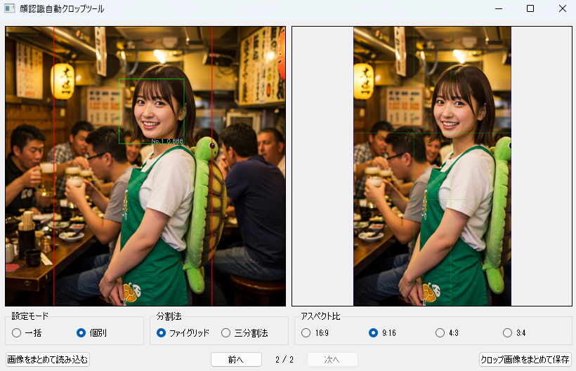

# Auto Face-Aware Image Cropper

画像から顔を検出し、顔の位置を中心として16:9やその他選択したアスペクト比に自動クロップするツールです。写真の構図法（三分割法またはファイグリッド）を活用して、人物の顔や目の位置を最適な構図に配置します。

<div align="center">
  <br>
  <em>アプリケーションの画面１</em>
</div>

<div align="center">
  <br>
  <em>アプリケーションの画面２</em>
</div>

<br>

<div align="center">
  <br>
  <em>クロップ結果のサンプル１</em>
</div>

<div align="center">
  <br>
  <em>クロップ結果のサンプル２</em>
</div>

## 機能概要

- 画像から人物の顔を自動検出
- 検出した顔の位置を中心として選択したアスペクト比に自動クロップ
- 複数のアスペクト比(16:9、9:16、4:3、3:4)から選択可能
  - デフォルトは16:9
  - アプリ起動前後を問わず自由に切り替え
  - プレビュー・保存ともに選択中の比率で生成される
- **構図法を選択可能**
  - **三分割法（Rule of Thirds）**: 1:1:1 の比率で分割し、交点や線上に被写体を配置。
  - **ファイグリッド（Phi Grid / 黄金比）**: 1:0.618:1 の比率で分割し、より中央に被写体を集める構図。
- 選択した構図法に基づき、目の位置や顔の中心を最適なラインに自動調整
- シンプルなGUIインターフェイスで簡単操作
  - 一括設定 / 個別設定モード
    - 一括モード: 全ての画像に同一設定（アスペクト比・構図法）を適用
    - 個別モード: 画像ごとに設定を保存・切り替え
    - モード切替による既存設定の初期化動作もサポート
- 元画像とクロップ後の画像をリアルタイムでプレビュー
- クロップした画像を任意の場所に保存可能
- **MediaPipeの高性能な顔検出機能**で様々な顔のパターンに対応
- 顔認識結果や選択中の構図グリッドを**視覚的に確認できる機能**

## 環境構築

### 必要条件

- Python 3.8以上
- Windows、macOS、またはLinux環境

### インストール手順

1. リポジトリをクローン

```
git clone https://github.com/yourusername/auto-image-crop.git
cd auto-image-crop
```

2. 仮想環境の作成とアクティブ化

```
# Windows
python -m venv venv
.\venv\Scripts\activate

# macOS/Linux
python -m venv venv
source venv/bin/activate
```

3. 必要なライブラリのインストール

```
pip install -r requirements.txt
```

## 使用方法

### 簡易起動スクリプト

以下の簡易起動スクリプトを使えば、仮想環境のアクティベーションからアプリケーションの起動までを一度に行うことができます：

- **Windows**: `run_app.bat` をダブルクリック
- **Linux/macOS**: ターミナルで `./run_app.sh` を実行（初回実行時は `chmod +x run_app.sh` で実行権限を付与してください）

これらのスクリプトは自動的に仮想環境をアクティベートし、アプリケーションを起動します。環境がまだ構築されていない場合は、セットアップ手順を表示します。

### 手動起動

1. アプリケーションの起動

```
python run.py
```

2. 設定モードを選択（一括 / 個別）。
   ・「一括モード」では全画像に同一設定を適用、
     「個別モード」では画像ごとに設定を記憶・切り替え
3. **分割法を選択（三分割法 / ファイグリッド）**。
4. アスペクト比を選択（16:9、9:16、4:3、3:4）。
5. 「画像をまとめて読み込む」ボタンをクリックして対象画像を選択。
   読み込み後に自動でプレビューおよびクロップが実行されます。
6. 画像一覧を切り替えつつ、個別モード時は分割法や比率の変更が各画像に反映可能。
7. 「クロップ画像をまとめて保存」ボタンで、
   設定に応じたクロップ画像を一度に出力。

## 顔認識の技術

このアプリケーションでは、Googleが開発した最新のMediaPipe顔検出技術を採用しています：

### MediaPipeの高性能顔検出

- **ディープラーニングベースの先進的な顔検出**：
  - 高精度な顔検出と位置特定
  - 様々な顔の向きや表情、照明条件下でも安定した検出
  - 横顔や部分的に隠れた顔に対しても優れた認識精度
  - 異なる人種や年齢、メガネ着用などの多様なケースに対応
  - 軽量かつ高速な処理のためモバイルデバイスでも実用的な性能

### 顔検出の判定条件とスコア算出式

複数の顔が検出された場合、以下の3つの要素を考慮して最適な顔を選択します：

1. **顔のサイズ評価 (40%)**：
   - 顔の面積（幅×高さ）が大きいほど高スコア
   - 計算式： `size_score = (顔の面積) / (検出された最大の顔の面積)`
   - 大きい顔ほど主要な被写体である可能性が高いという考えに基づく

2. **中央度評価 (40%)**：
   - 顔が画像の中心に近いほど高スコア
   - 計算式： `center_score = 1.0 - (中心からの距離) / (検出された最も遠い顔の距離)`
   - 中央に位置する顔ほど主要な被写体である可能性が高いという考えに基づく

3. **鮮明度評価 (20%)**：
   - 顔がより鮮明であるほど高スコア
   - 計算式： `sharpness_score = (顔領域の鮮明度) / (検出された最も鮮明な顔の鮮明度)`
   - 鮮明度はラプラシアンフィルタを使用して顔領域のエッジの強さを測定

**最終スコア算出式**：
```
total_score = (0.4 × size_score) + (0.4 × center_score) + (0.2 × sharpness_score)
```

この重み付けスコアが最も高い顔を選択し、クロップの基準として使用します。これにより、一般的な写真で最も重要な被写体となる顔を優先的に選択できます。

### 顔検出処理の最適化

- 顔領域を10%拡張して認識精度を向上
- 複数の顔が検出された場合は最も大きい顔を優先
- 顔の中心位置と大きさを正確に特定

### 視覚的フィードバック機能

<div align="center">
  <br>
  <em>視覚的フィードバック表示の例</em>
</div>

- **顔の矩形表示**：
  - クロップの基準となった主要な顔：太い赤色の矩形（線幅2）で表示
  - その他の検出された顔：灰色の矩形（線幅2）で表示
  - 表示用画像のみに矩形を描画し、保存画像には描画しない

- **スコア表示**：
  - 検出された各顔に「No.X 0.XXX」形式でスコアを表示
  - スコア表示は黒背景に白文字で矩形の右下に配置
  - スコア値が高いほどクロップの基準として優先される顔であることを示す

- **構図グリッドの表示**：
  - 緑色の線でクロップ後の**選択中**の構図ライン（三分割法またはファイグリッド）を表示。
  - 顔の配置がどのラインに合わせられているかを視覚的に確認可能。

## 構図の最適化

このアプリケーションは、写真撮影における代表的な構図法を活用して、より美しい構図のクロップを実現します。ラジオボタンで「三分割法」と「ファイグリッド」を選択できます。

### 三分割法（Rule of Thirds）

- 画像を縦横それぞれ3等分（比率 1:1:1）し、9つの長方形と4つの交点を作るグリッドを想定。
- 人物の目の位置を上部1/3のラインに自動的に合わせて配置。
- 顔の中心を最も近い縦方向の1/3ライン（左または右）に合わせて配置。
- 完全中央ではなく少しずらすことで、視覚的に安定感と動きのある構図を実現。

### ファイグリッド（Phi Grid / 黄金比）

- 黄金比（約1:1.618）に基づいて画像を分割する構図法。このツールでは、より一般的なバリエーションである 1 : (Φ-1) : 1 (約 1 : 0.618 : 1) の比率で線を配置します。
- 三分割法よりも線が中央に寄るため、被写体をより中央に引きつけつつ、完全な中央配置を避ける効果があります。
- 人物の目の位置を上部の短い区画のライン（上から約 38.2% の位置）に配置。
- 顔の中心を最も近い縦方向のファイグリッドライン（左右から約 38.2% の位置）に合わせて配置。

### 自動適用プロセス

1. 顔検出により顔の位置と大きさを特定。
2. 顔の形状から目の位置を推定し、縦方向の基準点を決定。
3. 選択された構図法（三分割法またはファイグリッド）の上部ラインに基準点が来るようにクロップ位置を計算。
4. 顔の中心が、選択された構図法の左右どちらの縦ラインに近いかを判定。
5. 近い方のラインに顔の中心が来るようにクロップ位置を水平方向に調整。

## 制約事項

- 非常に暗い画像や極端にぼやけた画像では検出精度が低下する場合があります
- MediaPipeの初期化時に情報メッセージが表示されることがありますが、動作に影響はありません

## ライセンス

このプロジェクトはMITライセンスの下で公開されています。詳細は[LICENSE](LICENSE)ファイルを参照してください。
